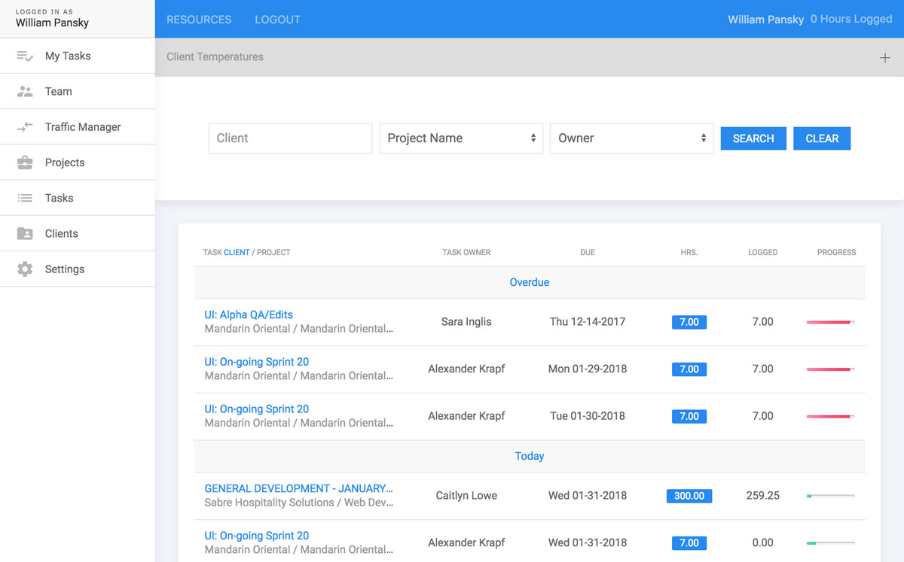
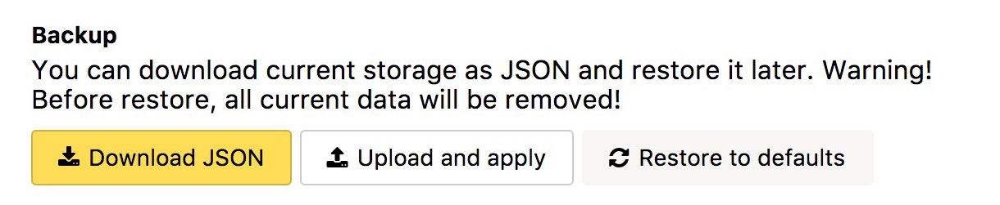

# Skynet.Override v0.1.5
> _"Assuming direct control."_

Styles and scripts powered by the [User JavaScript & CSS](https://chrome.google.com/webstore/detail/user-javascript-and-css/nbhcbdghjpllgmfilhnhkllmkecfmpld) Chrome extension to reconfigure the front-end of Skynet.

## Notice

The code found in this project _**does not**_, in any way, conflict with the original SVN repository. All JavaScript interaction is limited to front-end DOM manipulation; meaning it's tweaking the presentational aspect in a way anyone with Chrome devtools can do. It does not compromise or tap into the server, database, or other core aspects of Skynet. It's simply a visual (aesthetic) upgrade.

## Features

Skynet.Override strives to provide a modern interface experience for the outdated front-end with help from the [UIkit](https://getuikit.com/) framework.

## Installing / Getting started

Quick and easy setup. 

1. Install the [User JavaScript & CSS](https://chrome.google.com/webstore/detail/user-javascript-and-css/nbhcbdghjpllgmfilhnhkllmkecfmpld) Chrome extension.
2. Download the [latest release](https://github.com/williampansky/skynet.override/releases), unzip it, and find the latest `JSON` file inside the `/dist` directory.
3. Open the extension's options view and navigate to the _Settings > Backup_ section.
4. Click the **Upload and apply** button, navigate to your downloaded `JSON` file and upload it _(confirm the pop-up alert)_.

5. Profit!

You should now be able to navigate through a reinvigorated and mordern Skynet.

## Development

### Built With
99% of the codebase is built with vanilla JavaScript (ES6). There's one or two `@TODO` items that need refactoring – _(as Skynet already uses jQuery v1.3)_.

### Contributing

If you want to help out, feel free to edit the codebase (either via the `/src` directory copies or by exporting a `JSON` backup) and submit a pull request.

## Versioning

* v0.1.5 — March 11, 2018
    * `MAINTENANCE` General refactoring and clean-up.
* v0.1.4 — February 22, 2018
    * `ENHANCEMENT` Added pulse animation to "updated" label types.
* v0.1.3 — February 21, 2018
    * `ENHANCEMENT` Added back labels to `.live-results`.
* v0.1.2 — February 2, 2018
    * `FEATURE` Finished new resource modal implementation. New resources can now be added to the JSON array defined inside of @name resourcesList.
    * `BUG FIX` General fixes.
* v0.1.1 — January 31, 2018
    * `BUG FIX` taskProgress call on js:315;
* v0.1.0 — January 31, 2018
    * Initial beta release
    * Developed & tested in Chrome v63.0.3239.132 (Official Build) (64-bit).
    * Bugs may be reported to the [issues](https://github.com/williampansky/skynet.override/issues) tracker.

---

###### Copyright © 2018 Sabre Hospitality Solutions
